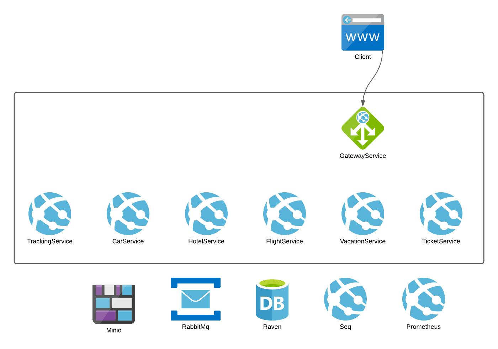

# BookVacation



A project to buy a vacation, consisting of a flight ticket, hotel room reservation and car rental.

## Table of Contents

- Architecture
- Microservice Technologies
- Service Technologies
- Documentation
- Setup

## Architecture

Made up of microservices, and utilizes the routingslip pattern for distributed transactions.

## Microservice Technologies

- Dotnet
- Aspnet
- Masstransit
- Serilog
- RavenDB
- Minio

## Service Technologies

- Seq
- RavenDB
- Prometheus
- Grafana
- Rabbitmq
- Minio
- Docker
- Terraform
- Kubernetes

## Documentation

Link to [Documentation](https://jokk-itu.github.io/BookVacation/)

## Setup

The project can be build using the dotnet-cli or docker.
The project can be run using docker-compose, kubernetes locally or kubernetes on digitalocean using terraform.

### Docker

Use the compose file in the root folder.
```
docker-compose up -d
```

### Kubernetes Locally

Use the start.sh script in the Kubernetes folder.
```
./start.sh
```

### Terraform (Kubernetes on Digitalocean)

Use the bootstrap.sh script in the Terraform folder.
```
./bootstrap.sh
```
